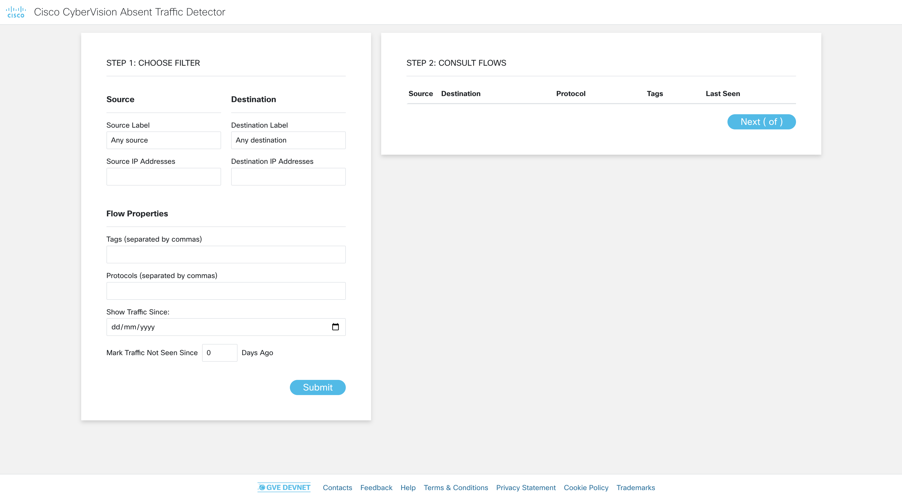
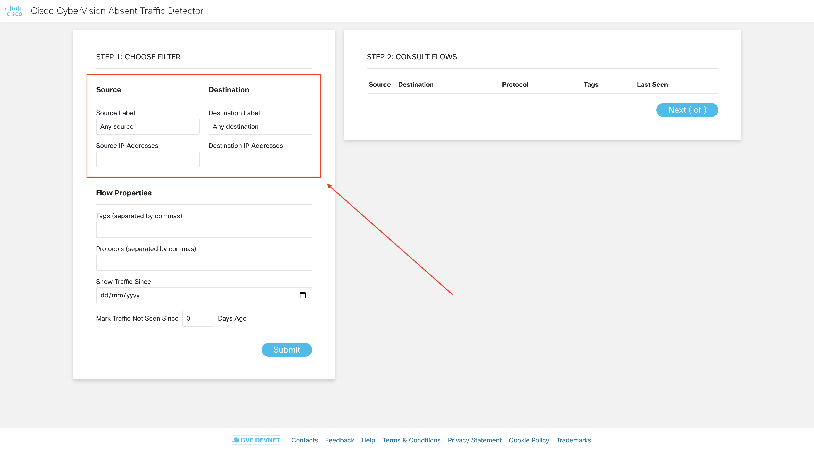
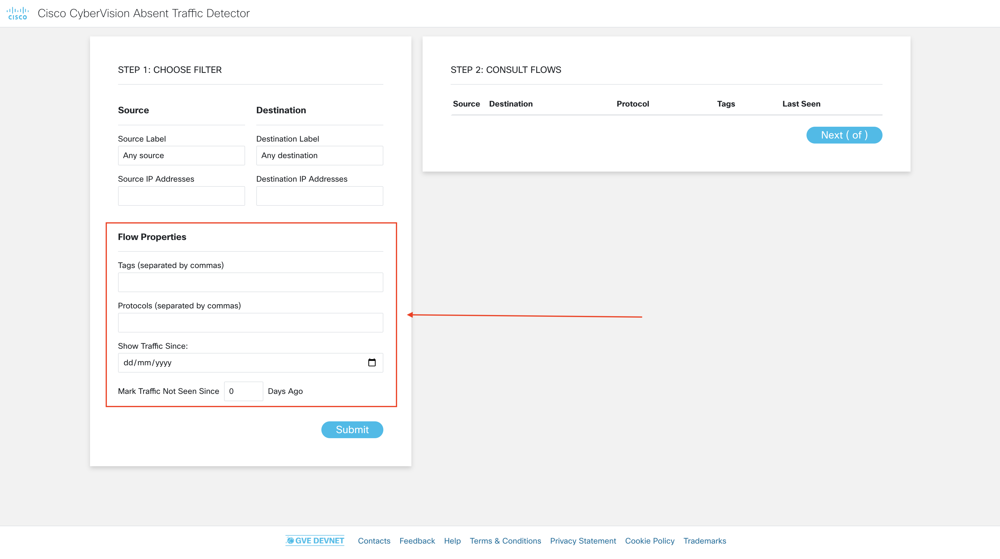
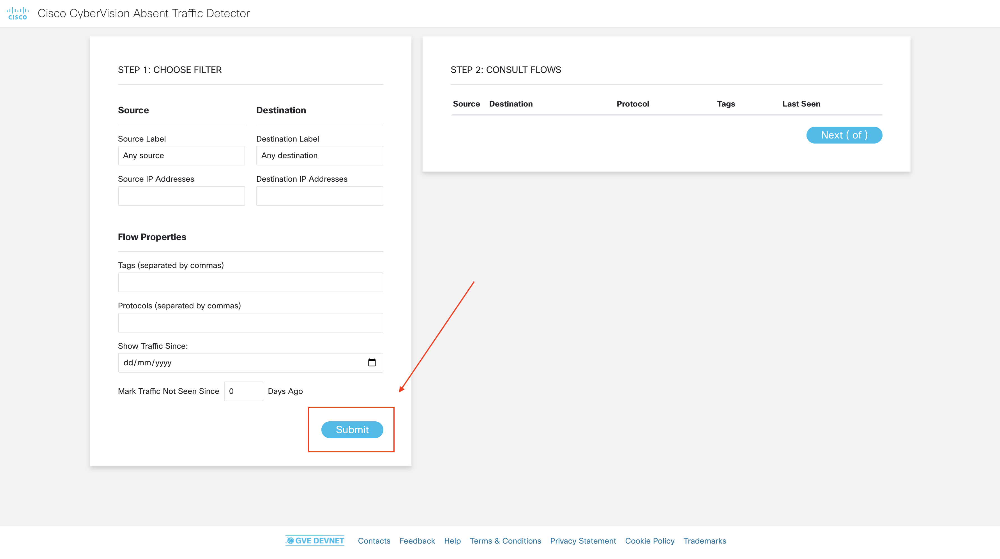
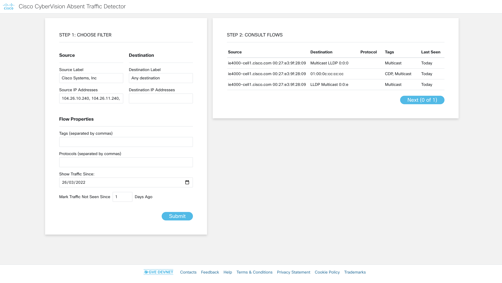
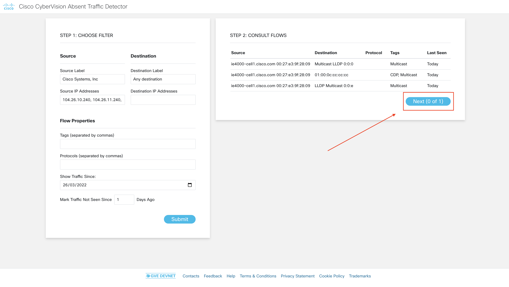

# GVE DevNet Cybervision Absent Traffic Detector
This prototype allows to detect OT traffic that was seen previously (in the last day/week/month) by Cisco Cybervision, but not anymore. A user can filter their traffic on (1) its source and destination, based on component tags, (2) flow tags, (3) flow protocol, and (4) to fall within a certain time frame. Next, the user can define which traffic to mark as anomalous, based on how long ago it was seen.

## Contacts
* Stien Vanderhallen
* Roaa Alkhalaf

## Solution Components
* Cybervision
* Cybervision REST API

## Installation/Configuration

The following commands are executed in the terminal.

1. Create and activate a virtual environment for the project:
   
        #WINDOWS:
        $ py -3 -m venv cv_detector_venv
        $ source cv_detector_venv/Scripts/activate

        #MAC:
        $ python3 -m venv cv_detector_venv 
        $ source cv_detector_venv/bin/activate
        
> For more information about virtual environments, please click [here](https://docs.python.org/3/tutorial/venv.html)

2. Access the created virtual environment folder

        $ cd cv_detector_venv

3. Clone this repository

        $ git clone https://wwwin-github.cisco.com/gve/gve_devnet_cybervision_absent_traffic_detection

4. Access the folder `gve_devnet_cybervision_absent_traffic_detection`

        $ cd gve_devnet_cybervision_absent_traffic_detection

5. Install the dependencies:

        $ pip install -r requirements.txt

6. Open the `.env` file and add the following environment variables:

    - `CYBERVISION_HOST`: The IP address of your Cybervision instance
    - `CYBERVISION_TOKEN`: Your Cybervision API token (this can be retrieved from the `Admin` submenu in your Cybervision console)
    - `FILTER_TAG`: The key name for the Cybervision component tag you want to filter your traffic source and destination on.

## Usage
1. To launch the app, type the following command in your terminal:

        $ python app.py

2. To access the app, navigate in a browser to `localhost:5555`

# Workflow

1. On `localhost:5555`, you find the landing page of the prototype

2. Optionally, adjust the filters on the left-hand side to first select the source and/or destination of the traffic you want to see. After selecting a label, the corresponsing IP addresses will be auto-populated.

3. Optionally, adjust the filters on the left-hand side to then select the tags, protocol and time period for the traffic you want to see. Aditionally, select after what amount of days you deem absent traffic anomalous, to get it marked as such.

4. Submit your filter to start retrieving the corresponding Cybervision traffic flows.

5. On the right-hand side of the page, consult the flows and the amount of days it has been since it was seen.

6. Use the button below the flow table to navigate through all flows.

### LICENSE

Provided under Cisco Sample Code License, for details see [LICENSE](LICENSE.md)

### CODE_OF_CONDUCT

Our code of conduct is available [here](CODE_OF_CONDUCT.md)

### CONTRIBUTING

See our contributing guidelines [here](CONTRIBUTING.md)

#### DISCLAIMER:
<b>Please note:</b> This script is meant for demo purposes only. All tools/ scripts in this repo are released for use "AS IS" without any warranties of any kind, including, but not limited to their installation, use, or performance. Any use of these scripts and tools is at your own risk. There is no guarantee that they have been through thorough testing in a comparable environment and we are not responsible for any damage or data loss incurred with their use.
You are responsible for reviewing and testing any scripts you run thoroughly before use in any non-testing environment.
